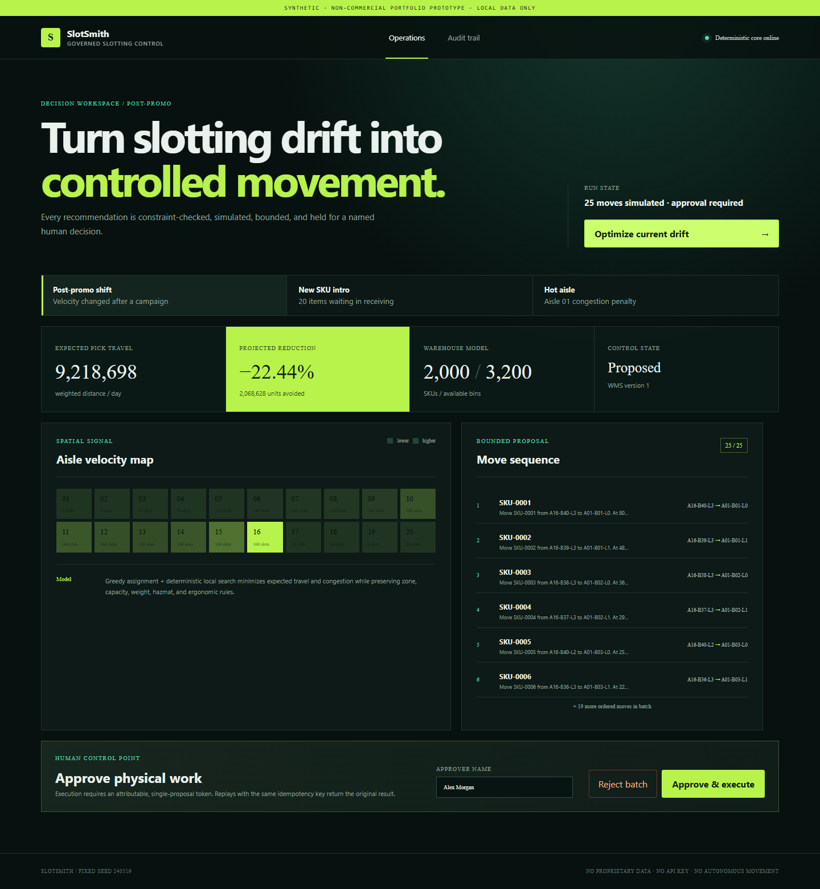
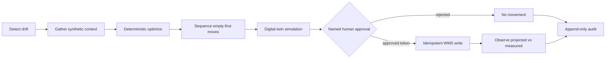
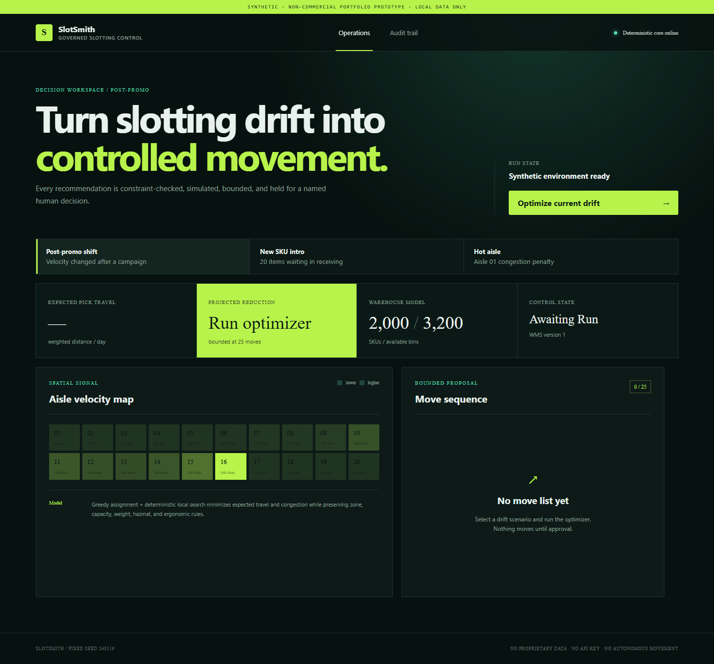
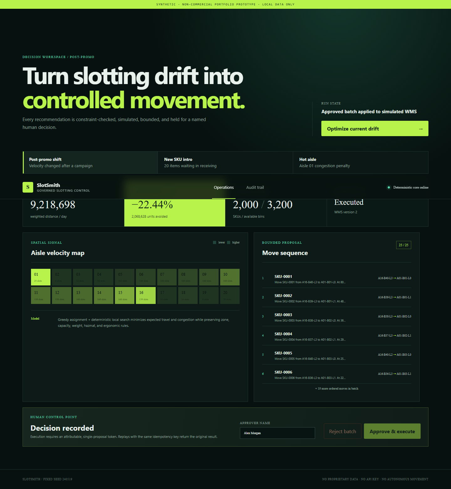
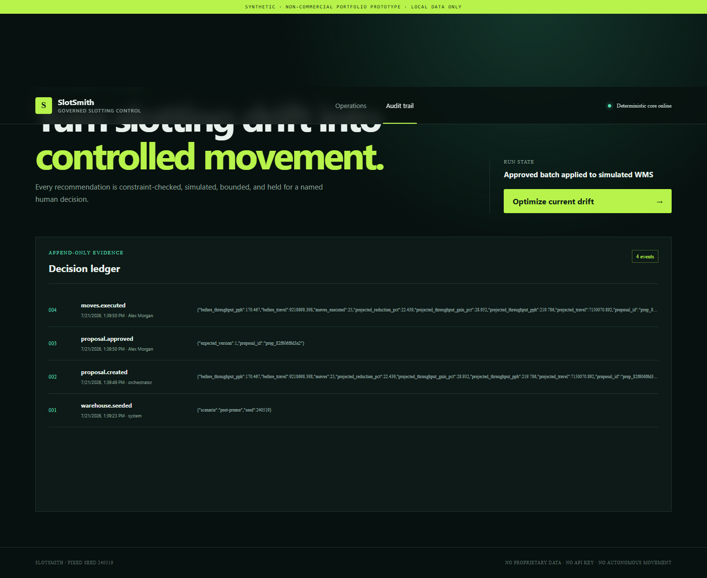
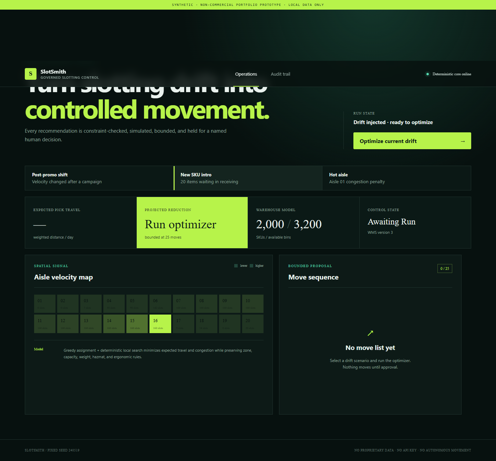
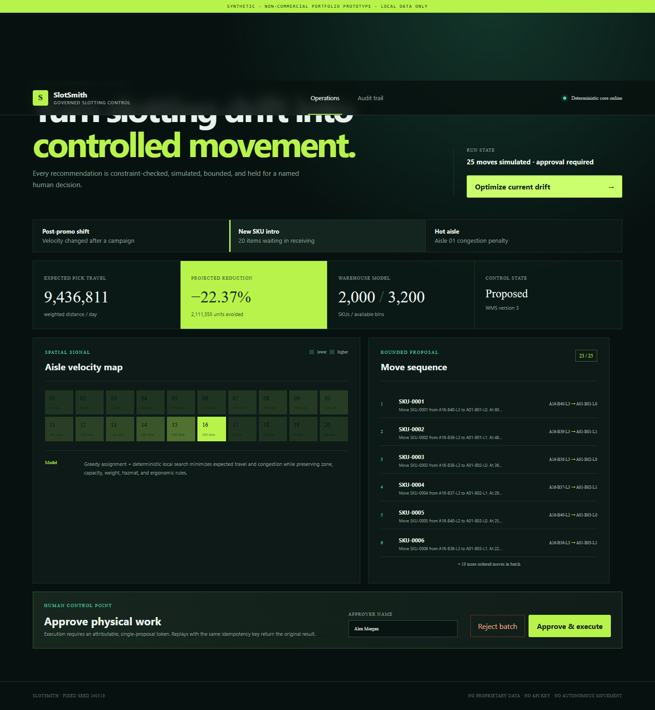
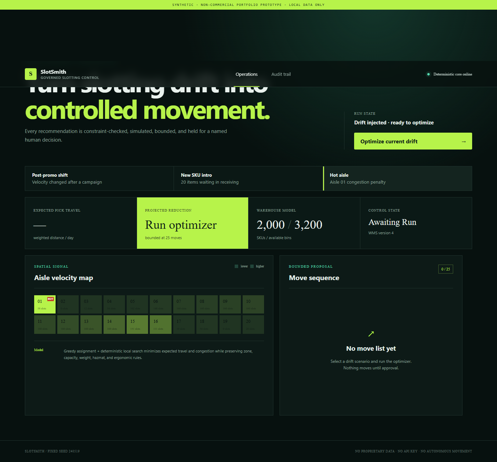
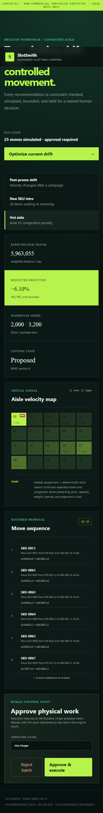

This is a SYNTHETIC, NON-COMMERCIAL PORTFOLIO PROTOTYPE built for learning and demonstration only. Not operated as a business, takes no customers, uses only locally-generated synthetic data. All monetization/market content is analysis, not an offer.

# SlotSmith

SlotSmith is a governed warehouse-slotting agent that turns operational drift into a bounded, constraint-safe move proposal. It uses operations research—not an LLM—to assign SKUs. A human must approve physical work, every simulated-WMS write is idempotent and version-checked, and every decision is appended to an immutable audit ledger.



## The decision loop



The core objective minimizes expected weighted pick travel, aisle congestion, and co-pick separation. One constraint predicate enforces location capacity, floor-only heavy items, hazmat/chilled zoning, and ergonomic golden-zone preference. Greedy construction plus deterministic local search produces at most 25 empty-first moves, so no intermediate state can double-occupy a bin. The digital twin reports both travel reduction and a comparative picks-per-hour throughput estimate before commit.

Generative AI is intentionally outside the decision boundary. `explain_move()` emits approver-facing prose through a deterministic, no-key template. A future provider can replace that text only; it cannot alter assignment, sequencing, constraints, approval, idempotency, or KPI math.

## Reproduce it

### Docker (recommended)

Prerequisite: Docker with Compose v2. The application makes no runtime network calls and needs no secrets or API keys.

```bash
docker compose up --build
```

Open <http://localhost:8000>. The repository commits the production console and Linux/Python 3.12 dependency wheels, so the application image builds with networking disabled once `python:3.12-slim` is present in Docker's local cache. CI pulls that base explicitly, runs `docker build --network=none`, starts Compose without rebuilding, and verifies container health. No application dependency, API key, or runtime network call is required.

### Local development

```bash
python -m venv .venv
# Windows: .venv\Scripts\activate
# macOS/Linux: source .venv/bin/activate
pip install -e ".[dev]"
pytest -q

cd frontend
npm ci
npm test
npm run build
cd ..

python -m uvicorn slotsmith.api:app --reload
```

Python 3.12 is the supported and CI-tested version. For a terminal-only proof of all scenarios:

```bash
python scripts/run_demo.py
```

## Fixed-seed demo evidence

Seed `240519` generates 20 aisles × 40 bays × 4 levels (3,200 bins), 2,000 Pareto/ABC-like SKUs, a 10,000-order synthetic stream, co-pick affinity derived from that stream, and scenario-specific drift. Each result below is an approved 25-move batch, computed by `scripts/run_demo.py` and regression-tested.

| Scenario | Trigger | Before | After | Travel reduction | Throughput gain | Measured variance |
|---|---|---:|---:|---:|---:|---:|
| Post-promo velocity shift | velocity shift | 9,218,698 | 7,150,071 | 22.439% | 28.932% | 0.0% |
| New-SKU introduction | 20 unslotted SKUs | 9,436,811 | 7,325,455 | 22.374% | 28.822% | 0.0% |
| Congested hot aisle | aisle congestion | 5,963,055 | 5,599,261 | 6.101% | 6.497% | 0.0% |

KPI units are synthetic weighted distance per day; they are useful for comparing assignments inside the demo, not for claiming real-world savings.

## Screenshot walkthrough

| Ready | Proposal review |
|---|---|
|  |  |
| **Approved and executed** | **Append-only audit** |
|  |  |
| **New SKU ready** | **New SKU proposal** |
|  |  |
| **Congested hot aisle** | **Mobile approval** |
|  |  |

## Governance invariants

- No move executes without a non-empty approver identity and a proposal-bound approval token.
- Proposal decisions use an expected version; stale or repeated decisions fail with a conflict.
- Execution requires an idempotency key. Retrying the same key returns the original result without duplicate writes or audit events.
- The move batch is capped at 25 and simulated in sequence before commit.
- Warehouse writes use optimistic concurrency against the current WMS version.
- SQLite triggers reject `UPDATE` and `DELETE` on the audit ledger.
- Infeasible proposals stop before approval and are surfaced as explicit errors.
- Infeasible optimization also emits an `optimization.escalated` audit event.
- All catalog, orders, affinity, velocity, and location data is generated locally from a fixed seed.

## Repository map

```text
src/slotsmith/
  domain.py      typed domain inputs and outputs
  seed.py        fixed-seed warehouse and three injected scenarios
  engine.py      constraints, KPI, optimizer, sequencing, simulation, explanation
  service.py     governed orchestrator, SQLite WMS, approval, execution, audit
  api.py         FastAPI tool surface and built-console hosting
frontend/src/    React/TypeScript operator console
tests/           deterministic, constraint, KPI, and governance regression tests
scripts/         three-scenario end-to-end demo
docs/            screenshots, architecture notes, and phase reviews
vendor/runtime/  hashed Linux/Python 3.12 wheels for network-disabled builds
```

OpenAPI documentation is available at `/docs`; the bounded tool endpoints cover trigger detection, warehouse context, optimization/proposal, approval or rejection, execution, outcome observation, and audit retrieval.

## Interview talking points

**Why optimization instead of an LLM?** Slotting is a constrained assignment problem with a numeric objective and hard safety rules. A deterministic optimizer is reproducible, testable, and able to prove that every proposed location satisfies constraints. Language generation adds value only when translating a computed move into clear operator rationale.

**Why approval and audit?** A move list causes physical labor and can interrupt fulfillment. The approver identity, versioned proposal, bounded batch, proposal-bound token, idempotency key, optimistic WMS write, and append-only ledger create a reviewable chain from recommendation to consequence.

**How would this connect to a real WMS?** Keep the pure engine and replace the SQLite repository with an adapter that reads inventory/location versions and writes through the WMS's transactional API. Map native location and product rules into the same typed constraint model, preserve external idempotency keys, stage moves in the WMS task queue, and reconcile scan events against projections. No proprietary data or live credentials are needed—or accepted—by this prototype.

## Limitations

This portfolio prototype uses a simplified rectilinear distance model, one SKU face per bin, a synthetic rather than real order history, and a deterministic observation equal to the simulated outcome. It is not a labor-management system, inventory authority, or production safety certification. See [phase review checkpoints](docs/review-checkpoints.md) for the defects deliberately hunted and the [release-readiness assessment](docs/release-readiness.md) for verified gates and the remaining external CI check.
